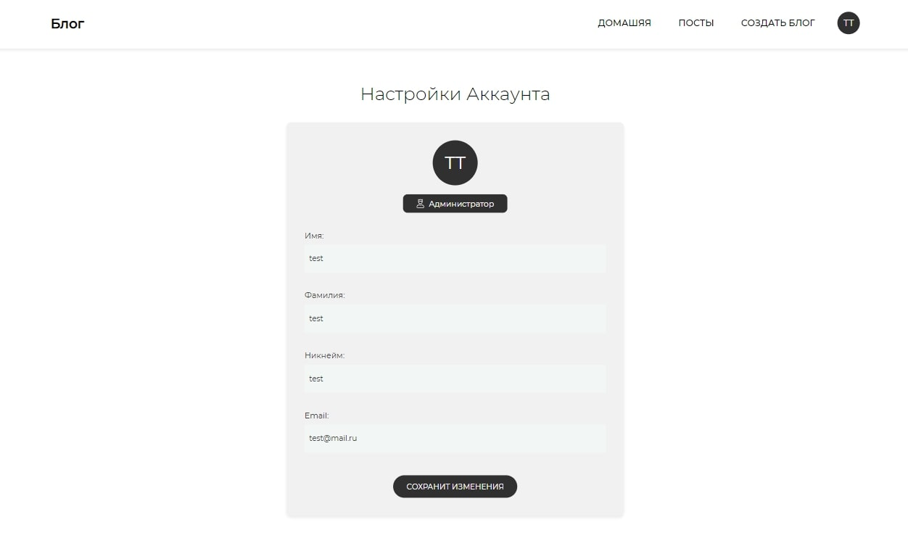

# ✔️ Chastichka Design Blog 📑




## Project Information

This is app that provide you

This app provide you:

- SignIn, SignUp this app / Reset your password
- Create posts, edit boards
- Set background image for specific post
- Set your profile settings, edit profile data

### API

🌍 Powerful rich text editor [Quill](https://quilljs.com)

## Demo

https://vue-blog-79178.web.app

### Technologies Used

| Technology | Description                                                                                                       | Link 🌐                                    |
| ---------- | ----------------------------------------------------------------------------------------------------------------- | ------------------------------------------ |
| VueJS      | The Progressive JavaScript Framework                                                                              | https://vuejs.org/index.html               |
|            | VueCLI: Standard Tooling for Vue.js Development                                                                   | https://cli.vuejs.org                      |
|            | Vuex: Vuex is a state management pattern + library for Vue.js applications.                                       | https://vuex.vuejs.org                     |
| JavaScript | High Level, Dynamic, Interpreted Language                                                                         | ----                                       |
| CSS        | Style sheet language used for describing the presentation of a document written in a markup language such as HTML | https://www.w3.org/Style/CSS/specs.en.html |
| Firebase   | Firebase is Google’s mobile application development platform that helps you build, improve, and grow your app.    | https://firebase.google.com                |
| QuillJS    | Powerful rich text editor                                                                                         | https://quilljs.com                        |
| Babel      | Javascript Compiler/Transpiler                                                                                    | https://babeljs.io                         |

## Project setup

```
npm install
```

### Compiles and hot-reloads for development

```
npm run serve
```

### Compiles and minifies for production

```
npm run build
```

### Lints and fixes files

```
npm run lint
```

### Customize configuration

See [Configuration Reference](https://cli.vuejs.org/config/).
